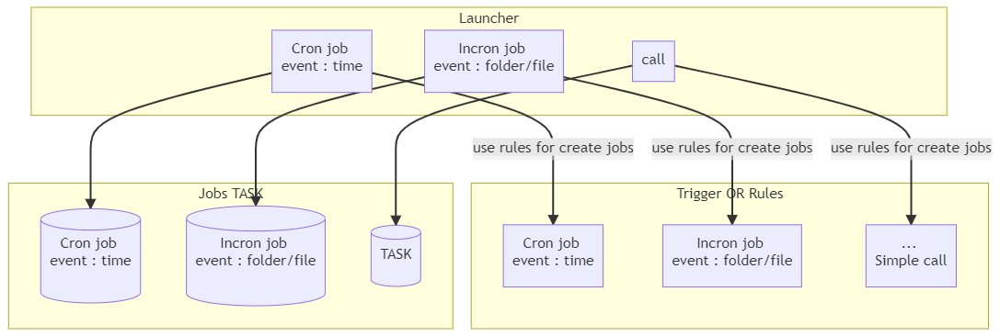

# 🚀 Alternative to Cronjob and Incronjob 🚀 <!-- omit in TOC -->


- [Introduction](#introduction)
  - [Description](#description)
- [Quick Start](#quick-start)
- [Stack](#stack)
- [study and analysis of feasability for convert .sh to java](#study-and-analysis-of-feasability-for-convert-sh-to-java)
  - [Bash fonctionnement](#bash-fonctionnement)
  - [Incron job alternative in Java](#incron-job-alternative-in-java)
    - [Jnotify](#jnotify)
    - [NIO2 since java 7](#nio2-since-java-7)
  - [Cron job alternative in Java](#cron-job-alternative-in-java)
    - [Openshift](#openshift)
    - [Quartz](#quartz)
- [Conclusion](#conclusion)
  - [Incron jobs](#incron-jobs)
  - [Cron jobs](#cron-jobs)
  - [Functionnement](#functionnement)
- [Implementation solution](#implementation-solution)
  - [Crontab](#crontab)
    - [list of crontab](#list-of-crontab)
  - [Incrontab](#incrontab)
    - [list of incrontab](#list-of-incrontab)
  - [Conclusion](#conclusion-1)
    - [How to add a jobs in java using Handler.java ?](#how-to-add-a-jobs-in-java-using-handlerjava-)
      - [Cronjob](#cronjob)
      - [Incronjob](#incronjob)
- [Alternative libraries for implementing the same behaviour with other programming language](#alternative-libraries-for-implementing-the-same-behaviour-with-other-programming-language)
  - [C](#c)
  - [Python](#python)
  - [Javascript](#javascript)


<br>
<br>

___

## Introduction
### Description

The first goal of this side project is to study the feasability for replace batch job (cronjob, incronjob) by Java or other programming language so we can have a better error handling on it, we can also use it even if we are not on Unix system. Basically Cronjob is a task performed periodically and inCronJob a task performed when an event system happens on a monitored file or folder. So that's can be usefull for backup data on a server or synch file beetween multiple server.

Here some usecase :
* [Synchronize Data Between Servers using Incron [Linux]](https://nuwant.medium.com/synchronize-data-between-servers-using-incron-linux-d683e990d43a)
* [Syncronize Files Between Two Ubuntu Servers Using Unison and Incron](https://www.ma-no.org/en/networking/syncronize-files-between-two-ubuntu-servers-using-unison-and-incron)
* [Use incron to Trigger Action when File Changes](https://www.garron.me/en/linux/use-incron-rsync-dropbox-backup.html)
* ...


<br>
<br>

___

## Quick Start 

setup our rule using eclipse :


then run your rule by clicking on __``Run``__ button

Then replace inside __``Handler.java``__ :
```java
		InCronJob myIncronjob1 = InCronJob.builderof("C:\\Users\\xpierre\\Desktop\\test")
				.setCREATE(Jobs3.class).build();
		myIncronjob1.Execute();
```
for use our own path on what you want to perform some task when a file or folder is create inside this directory. 

Then right click on __``Handler.java``__ and click on Run as > Java Application

<br>
<br>

___

## Stack 
* design pattern : [factory pattern](https://www.geeksforgeeks.org/factory-method-design-pattern-in-java/), [builder pattern](https://theboreddev.com/functional-patterns-in-java/)
* quartz
* java NIO2
* bash (sh, ksh)
* jNotify
* Thread

**Note:** we talk also about jNotify, bash wich can be an alternative. For factory builder we use the same concept because we implements Jobs from Quartz and override execute but we don't need a Jobsfactory for our usecase so i don't really use exactly this pattern. Also i perform some research for finding libraries for implementing the same behaviour with other programming language like : C#, python, javascript

<br>
<br>

___


## study and analysis of feasability for convert .sh to java
### Bash fonctionnement

<br>


We can have multiple bash working in the background wich performs task for the workflow. But respectively to them behaviour we can separate them on 3 families.
* Cron job : bash handled by time event (example : bash launched with windows task scheduler periodically). Nice for create back-up on your server for your data or other periodics tasks.
* Incron job : bash handled by system event (file/folder), basically here a bash will monitor a folder or files and when a changement will happen an event will be trigger to call some bash and performing automating task. That's tipically usefull for performing synchronisation beetween different server. 


<div align="center">


</div>

<details>
<summary>Mermaid code</summary>

```
graph TB
    subgraph Outside app
        A[Cron job <br> event : time]
        B[Incron job <br> event : folder/file]
    end

    subgraph Inside app
        AA[Cron job <br> event : time]
        BB[Incron job <br> event : folder/file]
        CC[... <br> event & call]
    end

click A "https://stackoverflow.com/tags/cron/info" "article stack-overflow + good reference [EN]" _blank
click B "https://linuxfr.org/news/exploiter-inotify-c-est-simple" "article linuxfr + good reference [FR]" _blank
```

</details>

<br>

Basically cron job and Incron job can be really usefull for automating task but bash script have also some disadvantage :
* Still running even if script got an error
* Difficult to perform debug with log
* Shell are designed to work on unix sytem and some unexpected error could happen on windows

<br>
<br>

___

### Incron job alternative in Java
Behaviour : bash handled by system event (file/folder), basically here a bash will monitor a folder or files and when a changement will happen an event will be trigger to call some bash and performing automating task. That's tipically usefull for performing synchronisation beetween different server. 

<div align="center">


</div>
<details>
<summary>mermaid code</summary>


```
graph LR
    subgraph step 2

    AA[<br> Folder / Repository <br> fa:fa-folder <br> New file <br><br> ]
    BB["Monitoring <br> fa:fa-file File created <br> fa:fa-file File modified <br> fa:fa-file File renamed <br> fa:fa-file File deleted"]
    CC((user))--send file with ftp-->AA
    BB--trigger changement-->AA
    BB--event call-->DD[perform some task]
    end
    subgraph step 1
    A[<br> Folder / Repository <br> fa:fa-folder<br><br> ]
    B["Monitoring <br> fa:fa-file File created <br> fa:fa-file File modified <br> fa:fa-file File renamed <br> fa:fa-file File deleted"]--watch-->A
    end


```
</details>
<br>


some ressources to go further :

Article :
* [Synchronize Data Between Servers using Incron [context]](https://nuwant.medium.com/synchronize-data-between-servers-using-incron-linux-d683e990d43a)
* [https://www.ma-no.org/en/networking/syncronize-files-between-two-ubuntu-servers-using-unison-and-incron [context]](https://www.ma-no.org/en/networking/syncronize-files-between-two-ubuntu-servers-using-unison-and-incron)
* [How to exploit inotify + usefull link for jNotify lib and sample using NIO2 from java 7 and later](https://linuxfr.org/news/exploiter-inotify-c-est-simple) 
* [java implementation for incron (File system events with Java 7)](https://markusjais.com/file-system-events-with-java-7/)
* [class pdf](http://www.shea-edriuviel.info/pdf/incron.pdf) 
* [Watching a Directory for Changes getting started doc from oracle java](https://docs.oracle.com/javase/tutorial/essential/io/notification.html)

StackOverflow topic with concern resolution when needed to use security protocol communication such as ssh :
* [Running Unison with incrond (inotify cron daemon)](https://unix.stackexchange.com/questions/284611/running-unison-with-incrond-inotify-cron-daemon)
* [Not able to ssh in to remote machine using shell script in Crontab](https://unix.stackexchange.com/questions/8903/not-able-to-ssh-in-to-remote-machine-using-shell-script-in-crontab)
* [https://www.cyberciti.biz/faq/linux-inotify-examples-to-replicate-directories/](https://www.cyberciti.biz/faq/linux-inotify-examples-to-replicate-directories/)
* [https://www.cyberciti.biz/faq/ssh-password-less-login-with-dsa-publickey-authentication/](https://www.cyberciti.biz/faq/ssh-password-less-login-with-dsa-publickey-authentication/)


<br>
<br>

___

#### Jnotify 

JNotify is a java library that allow java application to listen to file system events, such as:
* File created
* File modified
* File renamed
* File deleted

<br>

availablity :
|System d'exploitation|version|Link note|
|---|---|---|
|Windows|2000 or newer|[windows note](http://jnotify.sourceforge.net/windows.html)|
|Linux with INofity support|2.6.14 or newer|[linux note](http://jnotify.sourceforge.net/windows.html)|
|Mac OS X|10.5 or newer|[mac note](http://jnotify.sourceforge.net/macos.html)|

<br>

setup :
Add the so file that jnotify depends on to the java.library.path path. There may be multiple locations for this variable. Just add the libjnotify.so file attached to the jnotify compression package to any one of them. If you don't know the value of this variable, you can use System.getProperty("java.library.path") to view it. Of course, if you don’t want to be so troublesome, you can specify the JVM parameters when you start the program

variable environment :
```
-Djava.library.path=Your location 
```

<br>
<details>
<summary>java sample :</summary>

```java
import net.contentobjects.jnotify.JNotify;
import net.contentobjects.jnotify.JNotifyListener;

public class JnotifyMain {

    public static void main(String[] args) {

        try {
            new JnotifyMain().sample();
        } catch (Exception e) {
            e.printStackTrace();
        }

    }

    public void sample() throws Exception {
        // path to watch
        String path = "The directory that needs to be monitored";

        // watch mask, specify events you care about,
        // or JNotify.FILE_ANY for all events.
        int mask =  JNotify.FILE_CREATED |
                JNotify.FILE_DELETED |
                JNotify.FILE_MODIFIED|
                JNotify.FILE_RENAMED;

        // watch subtree?
        boolean watchSubtree = true;

        // add actual watch
        int watchID = JNotify.addWatch(path, mask, watchSubtree, new JNotifyListener()
        {
            public void fileRenamed(int wd, String rootPath, String oldName, String newName)
            {
                System.out.println("fileRenamed() : wd #" + wd + " root = " + rootPath + ", " + oldName + " -> " + newName);
            }

            public void fileModified(int wd, String rootPath, String name)
            {
                System.out.println("fileModified() : wd #" + wd + " root = " + rootPath + ", " + name);
            }

            public void fileDeleted(int wd, String rootPath, String name)
            {
                System.out.println("fileDeleted() : wd #" + wd + " root = " + rootPath + ", " + name);
            }

            public void fileCreated(int wd, String rootPath, String name)
            {
                System.out.println("fileCreated() : wd #" + wd + " root = " + rootPath + ", " + name);
            }
        });

        while (true){
            Thread.sleep(10000);
        }

    }

}
```
<br>
<br>

</details>

___

<details>
<summary>example from documentation : </summary>

```java

  public void sample() throws Exception {
    // path to watch
    String path = System.getProperty("user.home");

    // watch mask, specify events you care about,
    // or JNotify.FILE_ANY for all events.
    int mask = JNotify.FILE_CREATED  | 
               JNotify.FILE_DELETED  | 
               JNotify.FILE_MODIFIED | 
               JNotify.FILE_RENAMED;

    // watch subtree?
    boolean watchSubtree = true;

    // add actual watch
    int watchID = JNotify.addWatch(path, mask, watchSubtree, new Listener());

    // sleep a little, the application will exit if you
    // don't (watching is asynchronous), depending on your
    // application, this may not be required
    Thread.sleep(1000000);

    // to remove watch the watch
    boolean res = JNotify.removeWatch(watchID);
    if (!res) {
      // invalid watch ID specified.
    }
  }
  class Listener implements JNotifyListener {
    public void fileRenamed(int wd, String rootPath, String oldName,
        String newName) {
      print("renamed " + rootPath + " : " + oldName + " -> " + newName);
    }
    public void fileModified(int wd, String rootPath, String name) {
      print("modified " + rootPath + " : " + name);
    }
    public void fileDeleted(int wd, String rootPath, String name) {
      print("deleted " + rootPath + " : " + name);
    }
    public void fileCreated(int wd, String rootPath, String name) {
      print("created " + rootPath + " : " + name);
    }
    void print(String msg) {
      System.err.println(msg);
    }
  }
```

</details>


<br>
<br>
<br>

____

#### NIO2 since java 7
<br>

Extract from article : [java implementation for incron (File system events with Java 7)](https://markusjais.com/file-system-events-with-java-7/)
code for c, python and ruby : [link](https://markusjais.com/linux-file-system-events-with-c-python-and-ruby/)

<br>

In this post, we look at Java 7. Java 7 has several new classes in the java.nio.file package that let you listen to file system events. The number of events available is not as extensive as the ones in the C, Ruby and Python example.
If you want to use the inotify mechanism directly in Java, look at the following libraries:
* JNotify (previously describe)

<br>

In this example, we only look at the features of the new classes that come with Java 7. For this test, I used jdk-7-ea-bin-b144 64 bit on a Linux machine. It should work exactly like that when Java 7 is final.

<details>
<summary>code sample</summary>

```java
package com.markusjais;

import java.io.IOException;
import java.nio.file.FileSystems;
import java.nio.file.Path;
import java.nio.file.StandardWatchEventKinds;
import java.nio.file.WatchEvent;
import java.nio.file.WatchEvent.Kind;
import java.nio.file.WatchKey;
import java.nio.file.WatchService;

// Simple class to watch directory events.
class DirectoryWatcher implements Runnable {

    private Path path;

    public DirectoryWatcher(Path path) {
        this.path = path;
    }

    // print the events and the affected file
    private void printEvent(WatchEvent<?> event) {
        Kind<?> kind = event.kind();
        if (kind.equals(StandardWatchEventKinds.ENTRY_CREATE)) {
            Path pathCreated = (Path) event.context();
            System.out.println(Entry created: + pathCreated);
        } else if (kind.equals(StandardWatchEventKinds.ENTRY_DELETE)) {
            Path pathDeleted = (Path) event.context();
            System.out.println(Entry deleted: + pathDeleted);
        } else if (kind.equals(StandardWatchEventKinds.ENTRY_MODIFY)) {
            Path pathModified = (Path) event.context();
            System.out.println(Entry modified: + pathModified);
        }
    }

    @Override
    public void run() {
        try {
            WatchService watchService = path.getFileSystem().newWatchService();
            path.register(watchService, StandardWatchEventKinds.ENTRY_CREATE,
                     StandardWatchEventKinds.ENTRY_MODIFY, StandardWatchEventKinds.ENTRY_DELETE);

           // loop forever to watch directory
            while (true) {
                WatchKey watchKey;
                watchKey = watchService.take(); // this call is blocking until events are present

                // poll for file system events on the WatchKey
                for (final WatchEvent<?> event : watchKey.pollEvents()) {
                    printEvent(event);
                }

                // if the watched directed gets deleted, get out of run method
                if (!watchKey.reset()) {
                    System.out.println(No longer valid);
                    watchKey.cancel();
                    watchService.close();
                    break;
                }
           }

        } catch (InterruptedException ex) {
            System.out.println(interrupted. Goodbye);
            return;
        } catch (IOException ex) {
            ex.printStackTrace();  // don't do this in production code. Use a loggin framework
            return;
        }
    }
}

public class FileEventTest {

    public static void main(String[] args) throws InterruptedException {
        Path pathToWatch = FileSystems.getDefault().getPath(/tmp/java7);
        DirectoryWatcher dirWatcher = new DirectoryWatcher(pathToWatch);
        Thread dirWatcherThread = new Thread(dirWatcher);
        dirWatcherThread.start();
        
        // interrupt the program after 10 seconds to stop it.
        Thread.sleep(10000);
        dirWatcherThread.interrupt();


}
```
</details>
<br>

This is a simple example on how to use the new classes. I created a new Thread that listens in an infinite loop for changes in the directory “/tmp/java7”. For each event (when a file is created, modified or deleted), the event and the file name is printed to Stdout. Note that this also works when creating or deleting directories.

Basically you create a WatchService, register the directory to watch (with the events to watch for), loop forever, create a WatchKey and poll on the WatchKey for events, then go over the events and do something with them, like printing as in this example. When done processing the events, reset the WatchKey so that it can contain new events.
The method reset returns true if the WatchKey is still valid. When you delete the watched directory, it returns false and in this example, the code breaks out of the while loop and terminates.

Note that in a real production system, you would probably not use System.out.println but do something else, like updating the directory view in a file manager, sending an email (for example, when watching a directory for activities that are not allowed, etc) or other actions.

In this example, I interrupt the program after 10 seconds. This is just to show you how to end watching a directory.

To test it, create the directory “/tmp/java7” and then create, modify and delete a few files in it. To see the reset method in action, remove the directory. If you want to play longer than 10 seconds, just remove the call to interrupt at the end of the main method.

For more information, see the javadoc of Java 7:
http://download.oracle.com/javase/7/docs/api/java/nio/file/WatchService.html

<br>
<br>

### Cron job alternative in Java

<div align="center" size="50%">


</div>

Basically bash scheduling using cron job mean that bash was scheduling based on time event. So we can considere task scheduler for windows like an analog solution for this behaviour. 

<br>

#### Openshift

Openshift allow us to schedule cron job :
* [Official documentation link](https://docs.openshift.com/container-platform/4.8/nodes/jobs/nodes-nodes-jobs.html#jobs-create_nodes-nodes-jobs)

<br>

#### Quartz

Quartz is a java librairie which can be use for schedulling cron job. 

* [Quartz scheduling tutorial [EN]](https://www.youtube.com/watch?v=6ogkeEn1h7o)
* [Getting started with quartz [EN]](https://www.youtube.com/watch?v=uDkleDfmvBg)
* [Schedule mail using javamail + quartz [EN]](https://www.youtube.com/watch?v=O0mv8NjbfT4)


<br>
<br>

## Conclusion
### Incron jobs
comparative table of solutions for InCron Jobs (Scheduled task with the help of system event __CREATE MODIFY DELETED__ :

|Behaviour|Cron jobs (shell)|JNotify lib java for cron jobs base on C|Watch (NIO2) java natifs|
|---|---|---|---|
|unix (linux et autre version)|<div align="center">✔️</div>|<div align="center">✔️<br>with limitation</br></div>|<div align="center">✔️</div>|
|windows|<div align="center">✔️</div>|<div align="center">✔️<br>with limitation</br></div>|<div align="center">✔️</div>|
|mac|<div align="center">✔️</div>|<div align="center">✔️<br>with limitation</br></div> |<div align="center">✔️</div>|
|Java < 7 |<div align="center">✔️</div>|<div align="center">✔️</div>|<div align="center">❌</div>|
|Java > 7|<div align="center">✔️</div>|<div align="center">✔️</div>|<div align="center">✔️</div>|
|Complexity added|<div align="center">✔️</div>|<div align="center">❌<br>More complexity added because interface beetween C and Java</br></div>|<div align="center">✔️<br>No complexity added</br></div>|
|when file/filoder is Created|<div align="center">✔️</div>|<div align="center">✔️</div>|<div align="center">✔️</div>|
|when file/filoder is Modify|<div align="center">✔️</div>|<div align="center">✔️</div>|<div align="center">✔️</div>|
|when file/filoder is Deleted|<div align="center">✔️</div>|<div align="center">✔️</div>|<div align="center">✔️</div>|

For my usecase I implement it using Watch (NIO2) because that's a java natif solution and will not added more complexity to the project but jNotify can be an alternative for java <7. 

<br>

### Cron jobs

For cron jobs I schedule task with time event using : __Quartz__ 

An alternative can be Openshift

### Functionnement 

Graph general :
<div align="center" >


</div>

<details>
<summary>mermaid code </summary>

```code
graph TB

    subgraph Trigger OR Rules
        AA[Cron job <br> event : time]
        BB[Incron job <br> event : folder/file]
        CC[... <br> Simple call]
    end

    subgraph Jobs TASK
    
        AAA[(Cron job <br> event : time)]
        BBB[(Incron job <br> event : folder/file)]
        CCC[(TASK)]
    end

    subgraph Launcher
        A[Cron job <br> event : time]--use rules for create jobs-->AA
        B[Incron job <br> event : folder/file]--use rules for create jobs-->BB
        C[call]--use rules for create jobs-->CC
        A-->AAA
        B-->BBB
        C-->CCC
    end

```
</details>
<br>

___
## Implementation solution


### Crontab
#### list of crontab

We obtain the full list of Incrontab used on the server with the following command line :
```shell
crontab -l
```

<br>

Each line in output represent a crontab and can be decompose like this :
```shell
<rule> <command>
```

<br>

with `<rule>` :
```
*     *     *     *     * <command>
|     |     |     |     |
|     |     |     |     +----- Day of week (0 - 7) (Sunday equal 0 and 7)
|     |     |     +------- Month (1 - 12)
|     |     +--------- Day (1 - 31)
|     +----------- Hour (0 - 23)
+------------- Minute (0 - 59)
```


<br>
<br>

___

### Incrontab
#### list of incrontab 

We obtain the full list of Incrontab used on the server with the following command line :
```shell
incrontab -l
```

<br>

Each line in output represent an Incrontab and can be decompose like this :
```shell
<path> <mask> <command>
```

<details>
<summary>mask</summary>

```
IN_ACCESS           File was accessed (read) (*)
IN_ATTRIB           Metadata changed (permissions, timestamps, extended attributes, etc.) (*)
IN_CLOSE_WRITE      File opened for writing was closed (*)
IN_CLOSE_NOWRITE    File not opened for writing was closed (*)
IN_CREATE           File/directory created in watched directory (*)
IN_DELETE           File/directory deleted from watched directory (*)
IN_DELETE_SELF           Watched file/directory was itself deleted
IN_MODIFY           File was modified (*)
IN_MOVE_SELF        Watched file/directory was itself moved
IN_MOVED_FROM       File moved out of watched directory (*)
IN_MOVED_TO         File moved into watched directory (*)
IN_OPEN             File was opened (*)
```
</details>
<details>
<summary>command</summary>

```shell
$$   dollar sign
$@   watched filesystem path (see above)
$#   event-related file name
$%   event flags (textually)
$&   event flags (numerically)
```
</details>

<div style="color:red;">

* __IN_CLOSE_WRITE : File opened for writing was closed (*)__ : will raise an event when the file is completely written and save and close __(that's similar to this.CREATE mask with java NIO2)__
* __$@   watched filesystem path (see above)__ : will be replace by the abolute path for the folder wich trigger the event (in our case -d flag will represent the argument $@ for the launch of the perl script) 
* __$#   event-related file name__ : will be replace by the name of the file wich trigger the event (in our case -d flag will represent the argument $# for the launch of the perl script)
</div>

**Note :** in red i highlight some usefull information for the usecase where we pass automatically the information contains by __``$@``__ and __``$#``__ information (respectively __folder path__ and __filename__ wich trigger the event) with our implementation of __InCronJob.java__ and nothing need to be setup inside __Handler.java__ for that. But to be able to access this variable inside our __Jobs.java__ .


<br>

[Source : How to trigger commands on File/Directory changes with Incron on Debian [HowToForge]](https://www.howtoforge.com/tutorial/trigger-commands-on-file-or-directory-changes-with-incron/)

<br>
<br>

### Conclusion

<table>
<tr>
<td>

```
.
└── cronhandler
    └── app
        ├── jobs
        │   ├── Jobs2.java
        │   └── Jobs3.java
        ├── App.java
        ├── CronJob.java
        ├── Handler.java
        └── InCronJob.java
```
</td>

<td>


* Handler.java : Launch cronjob and incronjob contained inside jobs
* jobs : different jobs in java


</td>

</tr>


</table>

#### How to add a jobs in java using Handler.java ? 

##### Cronjob

example : Launch __``Jobs2.class``__ using Cron `<rule>` qui vaut ``0 0/1 * 1/1 * ? *``
```java
		// methode(job, trigger);
		CronJob cronjob1 = new CronJob();
		cronjob1.execute(Jobs2.class, "0 0/1 * 1/1 * ? *");
```

<br>

`<rule>` :
```
*     *     *     *     * <command>
|     |     |     |     |
|     |     |     |     +----- Day of week (0 - 7) (Sunday equal 0 and 7)
|     |     |     +------- Month (1 - 12)
|     |     +--------- Day (1 - 31)
|     +----------- Hour (0 - 23)
+------------- Minute (0 - 59)
```

<br>
<br>

##### Incronjob

example : create an incronjob wich launch __``Jobs2.class``__ when a file or folder is created (__setCREATE__) inside this folder path ``C:\\Users\\xpierre\\Desktop\\test``
```java
		InCronJob myIncronjob1 = InCronJob.builderof("C:\\Users\\xpierre\\Desktop\\test")
				.setCREATE(Jobs2.class).build();
		myIncronjob1.Execute();
```

<br>

|option|description|
|---|---|
|`builderof(<path to monitor>)`|path to monitor with this incronjob|
|``setCREATE(<job>)``|launch `<job>` when a file or folder is created|
|``setDELETED(<job>)``|launch `<job>` when a file or folder is deleted|
|``setMODIFY(<job>)``|launch `<job>` when a file or folder is mofified|

<br>

**Note :** `<job>` is a class.java contained inside the folder ``jobs`` and implement ``Job`` from ``org.quartz.Job``

example : 
```java
package fms.app.jobs;

import org.quartz.Job;
import org.quartz.JobExecutionContext;
import org.quartz.JobExecutionException;

public class Jobs2 implements Job {

	@Override
	public void execute(JobExecutionContext context) throws JobExecutionException {
		System.out.println("Hello internet!");
	}

}
```


<br>
<br>

## Alternative libraries for implementing the same behaviour with other programming language 
### C#
* [Quartz.NET](https://www.quartz-scheduler.net/)
* [FileSystemWatcher](https://docs.microsoft.com/fr-fr/dotnet/api/system.io.filesystemwatcher?view=net-6.0) 

### Python
* [APScheduler](https://pypi.org/project/APScheduler/) 
* [WatchDog](https://github.com/gorakhargosh/watchdog)  
  * [article 1 [Alan R. Fachini]](https://blog.magrathealabs.com/filesystem-events-monitoring-with-python-9f5329b651c3)
  * [article 2 [Ng Wai Foong]](https://levelup.gitconnected.com/how-to-monitor-file-system-events-in-python-e8e0ed6ec2c)

### Javascript
* [cron-to-quartz](https://www.npmjs.com/package/cron-to-quartz)
* [fs.watch](https://nodejs.org/api/fs.html#fswatchfilename-options-listener)
* [fs.FSWatcher](https://nodejs.org/api/fs.html#class-fsfswatcher)
  * [stackoverflow](https://stackoverflow.com/questions/13698043/observe-file-changes-with-node-js)

<details>
<summary>StackOverflow Answer</summary>
Good news is that you can observe filechanges with Node's API.

This however doesn't give you access to the contents that has been written into the file. You can maybe use the fs.appendFile(); function so that when something is being written into the file you emit an event to something else that "logs" your new data that is being written.

fs.watch(): Directly pasted from the docs
```javascript
fs.watch('somedir', function (event, filename) {
    console.log('event is: ' + event);
    if (filename) {
        console.log('filename provided: ' + filename);
    } else {
        console.log('filename not provided');
    }
});
```
[Read here about the fs.watch(); function](https://nodejs.org/api/fs.html#fs_fs_watch_filename_options_listener)

EDIT: You can use the function

fs.watchFile(); 
[Read here about the fs.watchFile(); function](https://nodejs.org/api/fs.html#fs_fs_watchfile_filename_options_listener)

This will allow you to watch a file for changes. Ie. whenever it is accessed by some other processes of any kind.
</details>